# Why Kubernetes is the Ultimate Platform for AI Agents and MCP Servers

## Introduction

The rise of AI agents has introduced new operational challenges: How do you deploy, scale, and manage intelligent systems that need access to tools, require integration with multiple services, and must operate reliably 24/7? In this post, we'll explore why Kubernetes, combined with the Model Context Protocol (MCP) and a declarative approach, provides the ideal environment for running production AI agents.

## Architecture Overview

Let's start by understanding how AI agents, MCP servers, and Kubernetes work together:

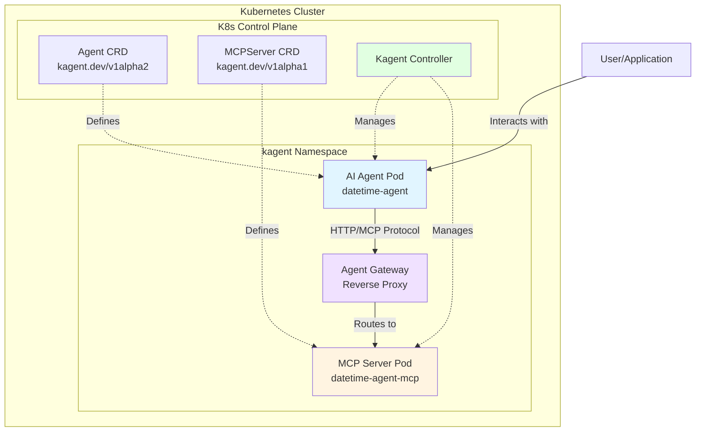

## The Declarative Approach: Infrastructure as Code for AI

### What is Declarative Configuration?

Traditional imperative approaches require you to manually execute commands to deploy and manage agents. The declarative approach with Kubernetes lets you define **what you want** rather than **how to create it**.

**Example: Our DateTime Agent**

```yaml
apiVersion: kagent.dev/v1alpha2
kind: Agent
metadata:
  name: datetime-agent
  namespace: kagent
spec:
  type: Declarative
  description: AI agent that provides date and time information
  declarative:
    tools:
      - type: McpServer
        mcpServer:
          kind: MCPServer
          name: datetime-agent-mcp
          toolNames:
            - get_date
            - get_time
            - get_datetime
    systemMessage: |
      You are a helpful assistant that provides accurate date and time information.
    modelConfig: default-model-config
```

With this single YAML file, Kubernetes:
- ✅ Creates the agent deployment
- ✅ Manages pod lifecycle
- ✅ Handles health checks
- ✅ Automatically restarts failed pods
- ✅ Connects the agent to its MCP tools
- ✅ Manages configuration updates

## Why Kubernetes is Perfect for AI Agents

### 1. **Resource Management & Isolation**

Each agent and MCP server runs in its own container with defined resource limits:

```yaml
resources:
  requests:
    cpu: 100m
    memory: 256Mi
  limits:
    cpu: 1000m
    memory: 1Gi
```

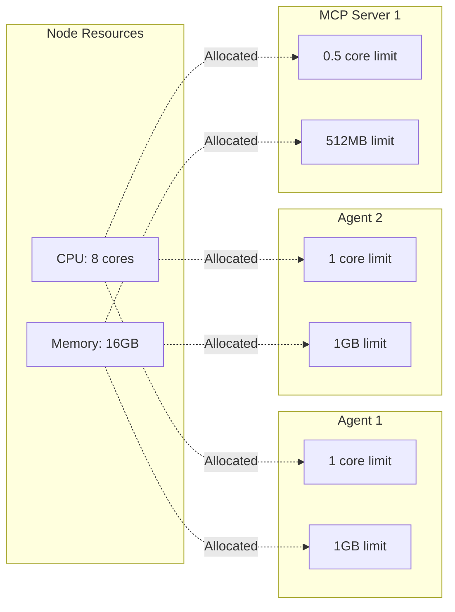

**Benefits:**
- Prevent one agent from consuming all resources
- Predictable performance
- Cost optimization through efficient resource allocation
- Protection against memory leaks or runaway processes

### 2. **Scalability: From One to Thousands**

Need more agents? Just scale:

```bash
# Scale to 3 replicas
kubectl scale agent datetime-agent --replicas=3 -n kagent
```

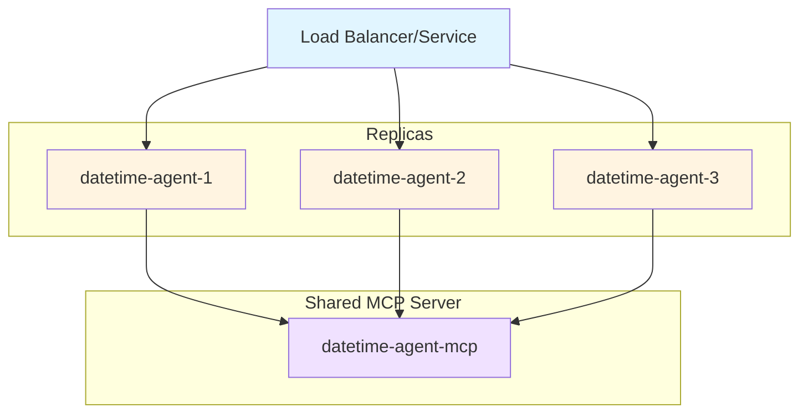

**Benefits:**
- Handle increased load automatically
- Zero-downtime deployments
- Horizontal Pod Autoscaling (HPA) based on CPU/memory/custom metrics
- Distribute agents across multiple nodes for high availability

### 3. **Service Discovery & Networking**

Kubernetes provides built-in DNS and service discovery:

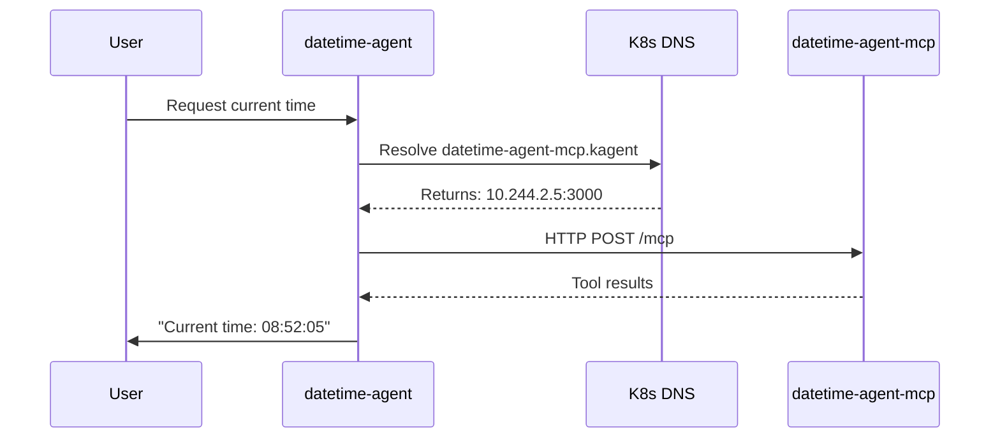

**Benefits:**
- No hardcoded IPs
- Automatic load balancing
- Service mesh integration (Istio, Linkerd)
- Network policies for security

### 4. **Self-Healing & Reliability**

Kubernetes continuously monitors and heals your agents:

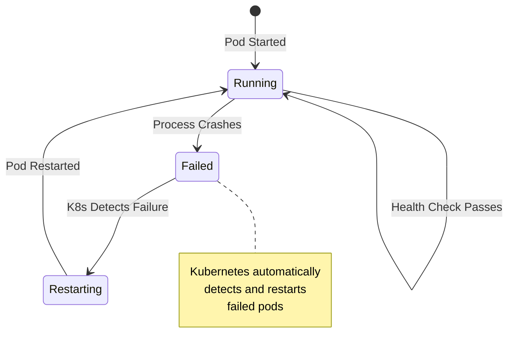

**Self-Healing Features:**
- **Liveness Probes**: Restart pods that are unresponsive
- **Readiness Probes**: Don't send traffic to pods that aren't ready
- **Crash Recovery**: Automatic pod restart on failure
- **Node Failure Recovery**: Reschedule pods from failed nodes

### 5. **Version Control & Rollbacks**

Deploy new agent versions safely:

```bash
# Deploy new version
kubectl apply -f datetime-agent-v2.yaml

# Rollback if there's an issue
kubectl rollout undo agent datetime-agent -n kagent
```

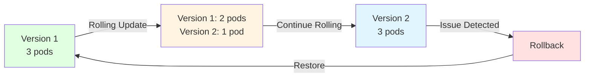

**Benefits:**
- Zero-downtime deployments
- Instant rollbacks
- Canary deployments
- A/B testing different agent versions

### 6. **Configuration Management**

Manage agent configurations with ConfigMaps and Secrets:

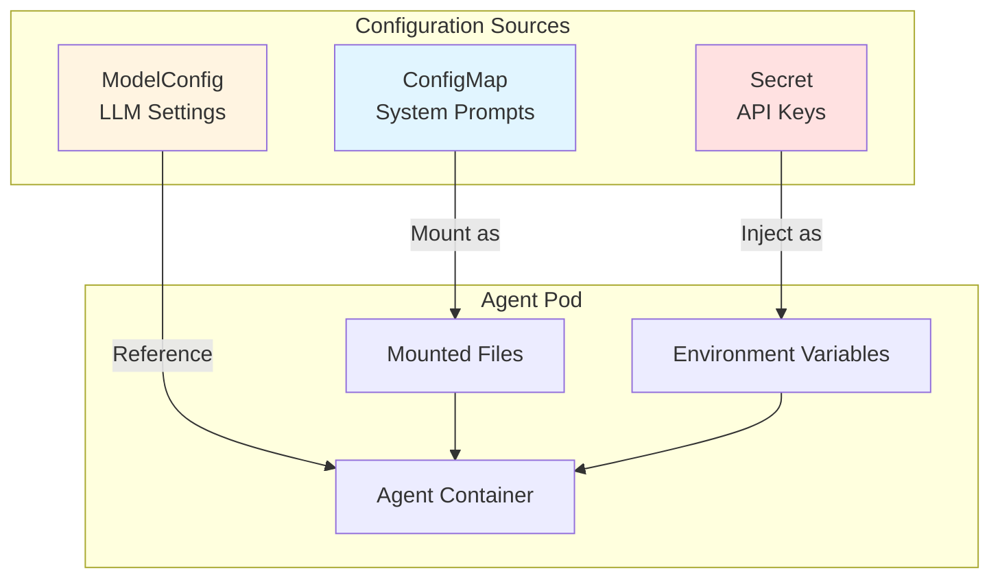

**Benefits:**
- Separate configuration from code
- Secure credential management
- Dynamic configuration updates
- Environment-specific settings (dev/staging/prod)

### 7. **Multi-Tenancy & Isolation**

Run multiple agents with different security profiles:

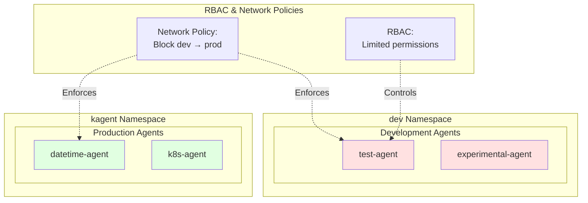

**Benefits:**
- Namespace isolation
- RBAC for security
- Resource quotas per namespace
- Network policies to control traffic

## The MCP Server Architecture

### Separation of Concerns

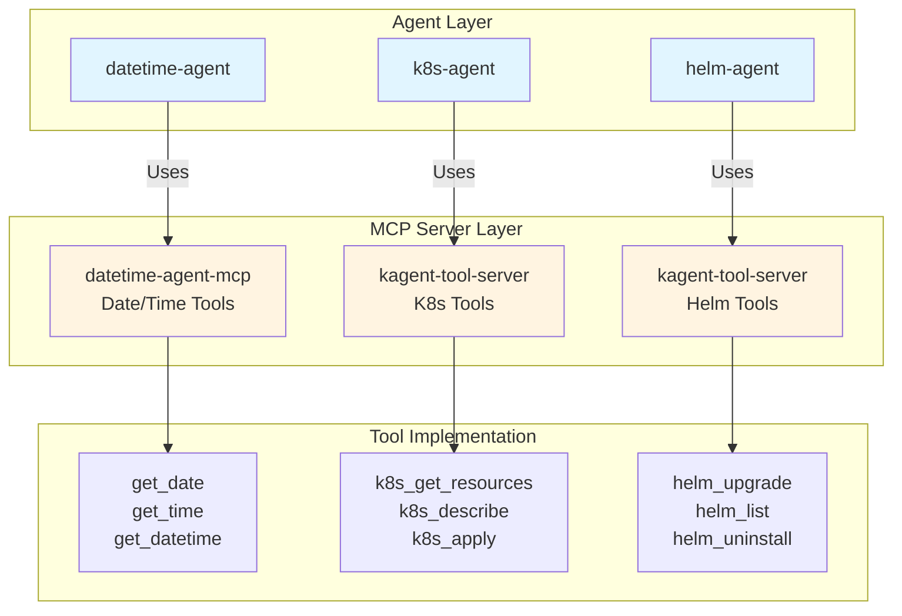

**Why Separate MCP Servers?**

1. **Reusability**: Multiple agents can share the same MCP server
2. **Independent Scaling**: Scale agents and tools independently
3. **Security**: MCP servers can have different RBAC permissions
4. **Maintenance**: Update tools without redeploying agents
5. **Resource Optimization**: One MCP server can serve many agents

### MCP Server Lifecycle

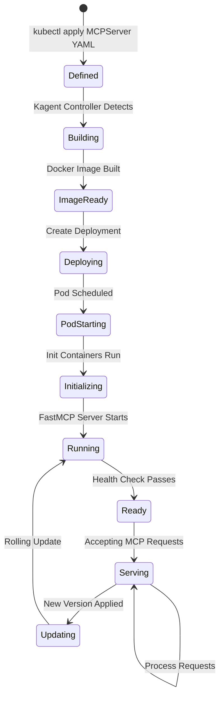

## Real-World Example: DateTime Agent

Let's walk through our datetime-agent deployment:

### Step 1: MCP Server Definition

```yaml
apiVersion: kagent.dev/v1alpha1
kind: MCPServer
metadata:
  name: datetime-agent-mcp
  namespace: kagent
spec:
  deployment:
    image: "datetime-server:latest"
    port: 3000
    cmd: "python"
    args: ["src/main.py"]
  transportType: "stdio"
```

This creates:
- A deployment with 1 replica
- A service at `datetime-agent-mcp.kagent:3000`
- An MCP-over-HTTP endpoint

### Step 2: Agent Definition

```yaml
apiVersion: kagent.dev/v1alpha2
kind: Agent
metadata:
  name: datetime-agent
  namespace: kagent
spec:
  type: Declarative
  declarative:
    tools:
      - type: McpServer
        mcpServer:
          kind: MCPServer
          name: datetime-agent-mcp
          toolNames:
            - get_date
            - get_time
            - get_datetime
```

This creates:
- An agent pod with the LLM runtime
- Automatic connection to the MCP server
- Tool discovery and registration

### Step 3: Request Flow

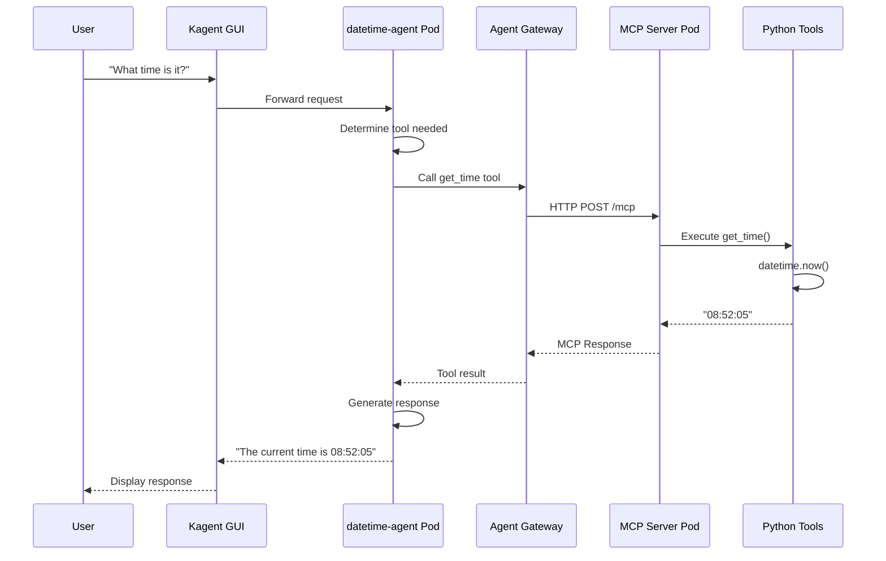

## Production Best Practices

### 1. Resource Limits

Always set appropriate limits:

```yaml
resources:
  requests:
    cpu: 100m      # Minimum guaranteed
    memory: 256Mi
  limits:
    cpu: 1000m     # Maximum allowed
    memory: 1Gi
```

### 2. Health Checks

Configure probes:

```yaml
livenessProbe:
  httpGet:
    path: /health
    port: 8080
  initialDelaySeconds: 30
  periodSeconds: 10

readinessProbe:
  httpGet:
    path: /ready
    port: 8080
  initialDelaySeconds: 5
  periodSeconds: 5
```

### 3. Monitoring & Observability

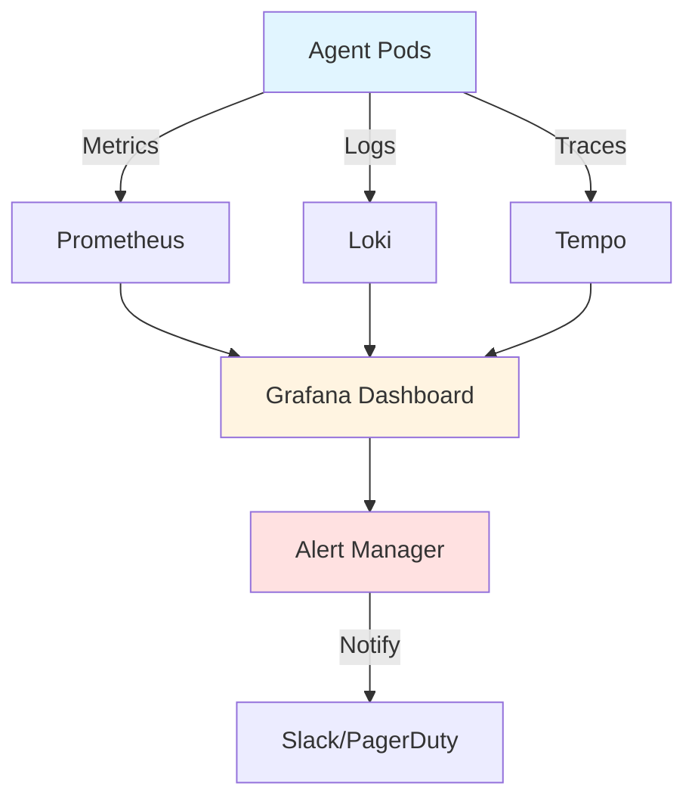

### 4. Security

- **Network Policies**: Restrict traffic between agents
- **RBAC**: Limit agent permissions
- **Pod Security Standards**: Enforce security baselines
- **Secrets Management**: Use Kubernetes Secrets or external vaults

## Comparison: Kubernetes vs Traditional Deployment

| Feature | Traditional VMs | Kubernetes |
|---------|----------------|------------|
| **Deployment** | Manual scripts, SSH | Declarative YAML, automated |
| **Scaling** | Manual provisioning | `kubectl scale` or autoscaling |
| **Recovery** | Manual restart | Automatic self-healing |
| **Networking** | Manual configuration | Built-in service discovery |
| **Updates** | Downtime required | Rolling updates, zero downtime |
| **Resource Management** | Over-provisioning | Efficient bin-packing |
| **Multi-tenancy** | Separate VMs | Namespaces, network policies |
| **Version Control** | Configuration scripts | GitOps, infrastructure as code |

## Conclusion

Running AI agents and MCP servers in Kubernetes provides:

✅ **Reliability**: Self-healing, automatic restarts, health checks
✅ **Scalability**: Horizontal scaling, load balancing
✅ **Efficiency**: Optimal resource utilization, multi-tenancy
✅ **Agility**: Fast deployments, instant rollbacks
✅ **Observability**: Built-in monitoring, logging, tracing
✅ **Security**: Isolation, RBAC, network policies
✅ **Maintainability**: Declarative configuration, version control

The declarative approach with Custom Resource Definitions (CRDs) means you define **what** you want (an agent with certain tools), and Kubernetes handles **how** to make it happen. This abstraction layer frees you from operational complexities and lets you focus on building intelligent agent systems.

## Getting Started

Want to try this yourself? Here's how to deploy your own datetime-agent:

```bash
# 1. Build the MCP server image
kmcp build --project-dir datetime-server -t datetime-server:latest

# 2. Load to your Kubernetes cluster
kind load docker-image datetime-server:latest --name your-cluster

# 3. Deploy both MCP server and agent
kubectl apply -f datetime-agent-deployment.yaml

# 4. Verify deployment
kubectl get agents -n kagent
kubectl get mcpservers -n kagent
```

The future of AI agents is declarative, scalable, and cloud-native. Kubernetes provides the foundation to build production-ready agent systems that can grow from prototype to enterprise scale.

---

*Built with [kagent](https://kagent.dev) - The Kubernetes-native platform for AI agents and MCP servers.*
